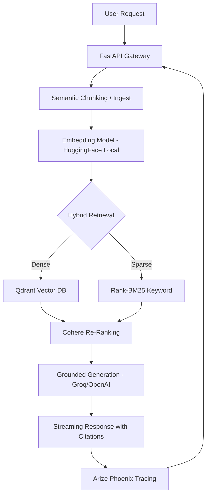

<p align="center">
  
</p>

<!-- ANIMATED TYPING -->
<p align="center">
  
</p>

<!-- HACKER DIVIDER -->


## `> systemctl status rag-engine.service`

```bash
● rag-production-system.service - AI Retrieval-Augmented Generation Engine
     Status: Operational (Standard HF Spaces Port: 7860)
     Engine: LlamaIndex @ v0.10+
     Vector Store: Qdrant (Local Persistent Storage)
     Embeddings: HuggingFace Local (BGE-Small-En-v1.5)
     Inference: Groq (Llama 3.3 70B) / OpenAI (GPT-4o)
     Observability: Arize Phoenix @ Port 6006
```

---

## `> architecture --verify`



---

## `> features --all`

- **🧬 Semantic Chunking**: Intelligent splitting for maximum context retention via `SemanticChunker`.
- **⚡ Hybrid Retrieval**: Dense Vector (Qdrant) + Sparse BM25 for 99% keyword/semantic recall.
- **🤗 HuggingFace Native**: Uses local HuggingFace embeddings for high-speed, cost-effective indexing.
- **🎯 Precise Re-Ranking**: Cohere Rerank layer ensures only the top-N most relevant chunks feed the LLM.
- **🔥 Citations & Grounding**: Strict system prompts force the model to cite `[Source N]` for every claim.
- **🔍 Full Observability**: Integrated Arize Phoenix for OpenInference tracing and RAGAS evaluation.
- **📦 Cloud Ready**: Native Docker support for seamless deployment to **Hugging Face Spaces**.

---

## `> ls /tech-stack`

<p align="center">
  
</p>

- **Core**: LlamaIndex, Transformers, Sentence-Transformers
- **Vector DB**: Qdrant (Local / Server)
- **Inference**: Groq (Llama 3.3), OpenAI API
- **Evaluation**: Ragas, Datasets
- **Monitoring**: Arize Phoenix, OTel

---

## `> deploy --target huggingface`

This project is optimized for **Hugging Face Spaces** using the provided `Dockerfile`.

### Automated Deployment
1. Create a new **Docker Space** on Hugging Face.
2. Push this repository to the Space.
3. HF will automatically build the image and expose the API/UI on port **7860**.

### Required Environment Variables
Configure these in your HF Settings > Variables:
- `GROQ_API_KEY`: For Llama 3 generation.
- `COHERE_API_KEY`: For reranking layer.
- `OPENAI_API_KEY`: (Optional) For GPT-4o paths.

---

## `> setup --local`

### 1. Initialize
```bash
git clone https://github.com/VptrCipher/rag-production-system.git
cd rag-production-system
python -m venv venv && source venv/bin/activate
pip install -r requirements.txt
```

### 2. Configure
```bash
cp .env.example .env
# Required: GROQ_API_KEY, COHERE_API_KEY
```

### 3. Run
```bash
python start_all.py
```

- **API**: `http://localhost:8000/api/v1`
- **Interface**: `http://localhost:8000/`
- **Tracing**: `http://localhost:6006`


<p align="center">
  
</p>
