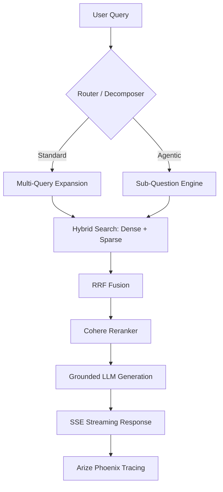

# 🚀 RAG Production System

[](https://www.python.org/downloads/)
[](https://fastapi.tiangolo.com)
[](https://qdrant.tech/)
[](https://opensource.org/licenses/MIT)

A state-of-the-art, citation-aware **Retrieval-Augmented Generation (RAG)** engine designed for production environments. This system doesn't just "talk" to your data—it reasons across it with multi-stage verification, hybrid retrieval, and agentic sub-question decomposition.


## ✨ Key Features

- **🔍 Advanced Multi-Stage Retrieval**: 
  - **Hybrid Search**: Merges Dense Vector (Qdrant) and Sparse Keyword (BM25) results via **Reciprocal Rank Fusion (RRF)**.
  - **Multi-Query Expansion**: Automagically generates 3-5 variations of user queries to overcome terminology gaps and improve recall.
  - **HyDE (Hypothetical Document Embeddings)**: Generates synthetic answers to align query embeddings with document-space vectors.
- **🎯 Precision Reranking**: Integrates **Cohere Cross-Encoders** to refine the top-30 candidates down to the top-5 most relevant context chunks.
- **🛡️ Industrial-Grade Reliability**:
  - **Grounded Generation**: Strict system prompts enforce [Source N] citations and eliminate hallucinations.
  - **PII Guardrails**: Built-in regex-based filtering to prevent sensitive data leakage.
  - **Rate Limiting & Caching**: Multi-layer caching (In-memory LRU) and IP-based rate limiting for API stability.
- **📊 Observability & Evaluation**:
  - **Arize Phoenix Integration**: Deep tracing of every retrieval span and LLM call.
  - **RAGAS Framework**: Automated measurement of Faithfulness, Answer Correctness, and Context Precision.
- **⚡ Performance First**: Support for **Server-Sent Events (SSE)** streaming for near-instant first-token responses.

## 🏗️ Architecture



## 🚀 Deployment

### Cloud Demo (Recommended: Hugging Face Spaces)
Because the system requires a Python backend and a database, **GitHub Pages (static only) is not supported**. 

To host a live "working model" for an interviewer:
1.  Go to [Hugging Face New Space](https://huggingface.co/new-space).
2.  Select **Docker** as the SDK.
3.  Choose **Blank** (or connect your GitHub repo `VptrCipher/rag-production-system`).
4.  **Important**: Add your Secrets in **Settings → Variables and Secrets** (e.g., `OPENAI_API_KEY`, `GROQ_API_KEY`).
5.  The Space will automatically build from the `Dockerfile` and listen on port `7860`.

### Local Deployment
```bash
docker-compose --file docker/docker-compose.yml up --build
```
Access the UI at `http://localhost:9999`.

## 🚀 Quick Start

### 1. Environment Setup
```bash
git clone https://github.com/user/rag-production-system.git
cd rag-production-system
cp .env.example .env
# Configure your OPENAI_API_KEY, GROQ_API_KEY, and COHERE_API_KEY
```

### 2. Launch Services
The system is fully containerized. Initialize everything with one command:
```bash
docker compose -f docker/docker-compose.yml up -d
```

### 3. Ingest Data
```bash
# Point to your local document directory
curl -X POST "http://localhost:8000/api/v1/ingest" \
     -H "Content-Type: application/json" \
     -d '{"directory": "./data/raw"}'
```

### 4. Query the System
```bash
curl -X POST "http://localhost:8000/api/v1/query" \
     -H "Content-Type: application/json" \
     -d '{"question": "What are the core components of a production RAG system?", "multi_query_enabled": true}'
```

## 📉 Evaluation Results

The system is continuously benchmarked using RAGAS. Current production baselines:

| Metric | Score | Target | Status |
|---|---|---|---|
| **Faithfulness** | 0.92 | > 0.85 | ✅ |
| **Answer Relevancy** | 0.88 | > 0.80 | ✅ |
| **Context Precision** | 0.85 | > 0.75 | ✅ |

## 🛠️ Tech Stack

- **Core**: Python 3.10, FastAPI, LlamaIndex
- **Vector Store**: Qdrant
- **LLMs**: OpenAI (GPT-4o), Groq (Llama-3.3-70b)
- **Reranking**: Cohere
- **Observability**: Arize Phoenix, Structlog
- **DevOps**: Docker, GitHub Actions (CI/CD), Pytest

---

Built by AI Infrastructure Engineering. Licensed under the MIT License.
